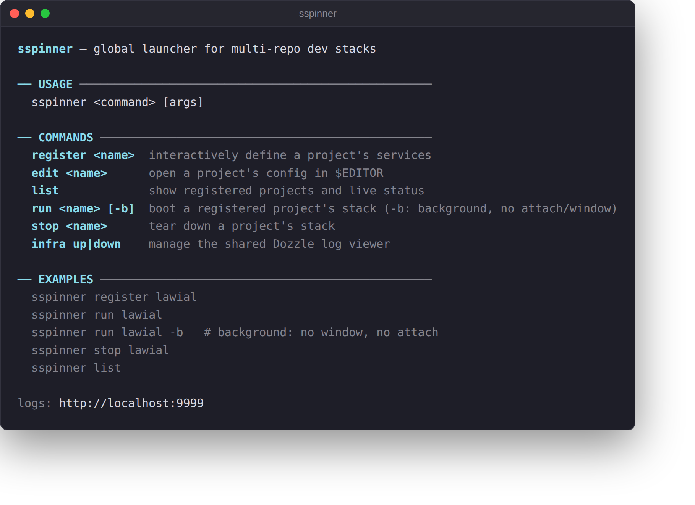
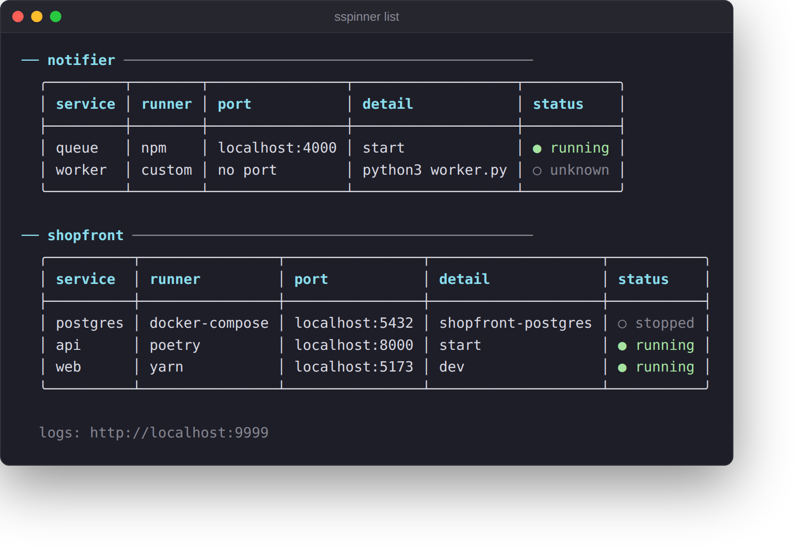

# SSpinner

Global launcher for multi-repo local dev stacks. You register a project once
— its services, where they live, and how each one is run (`docker compose`,
`yarn`, `pnpm`, `poetry`, or any custom command) — and from then on boot the
whole thing from anywhere with one command:

```bash
sspinner run myapp
```

Each service gets its own split pane (its actual live output — docker compose
logs, Vite/webpack output, whatever it prints), started in the order you
registered them, each one waited on before the next starts if you gave it a
port. Panes open in [Terminator](https://gnome-terminator.org/) if it's
installed, falling back to tmux, falling back to a plain sequential mode with
no panes at all. A shared Dozzle container gives a web-based view of every
project's docker logs regardless of which one is currently running.

<p align="center"></p>

## Install

```bash
git clone git@github.com:Carlstain/sspinner.git ~/tools/sspinner
~/tools/sspinner/install.sh
```

This symlinks `sspinner` onto `~/.local/bin`, wires up shell completion (see
below), and checks for `docker` (required) and `terminator`/`tmux` (optional —
`terminator` is recommended for the nicest split panes; `tmux` is used if
it's the only one found; `run` falls back to a sequential, no-split-panes
mode if neither is installed).

## Shell completion

`install.sh` adds a sourcing line to `~/.bashrc` and/or `~/.zshrc` (whichever
exist) — open a new shell afterward and `sspinner <TAB>` completes
subcommands, `sspinner run <TAB>` completes registered project names (pulled
live from the registry), and `sspinner infra <TAB>` completes `up`/`down`.
The scripts live in `completions/` if you want to source them manually
instead.

## Commands

```bash
sspinner register <project>   # interactive: add services one at a time
sspinner edit <project>       # open the raw config in $EDITOR
sspinner list                 # show every registered project + live up/down status
sspinner run <project>        # boot it: one pane per service, in order
sspinner run <project> -b     # boot it in the background: no window, no attach
sspinner stop <project>       # tear down its docker-compose services, close the panes
sspinner infra up / down      # manage the shared Dozzle log viewer directly
```

(`sspinner down <project>` still works as a deprecated alias for `stop`.)

`sspinner list` shows every registered project with a live status table —
green `● running` when a service's port answers (or its docker-compose
project has containers up), dim `○ stopped`/`○ unknown` otherwise:

<p align="center"></p>

### `run -b` boots without taking over your terminal

`-b`/`--background` skips Terminator entirely (no GUI window) and boots the
stack in a detached tmux session instead — same live status table while it
boots, but at the end you're returned straight to your shell with an
`attach with: tmux attach -t sspinner-<project>` pointer instead of being
attached. `sspinner stop` tears the whole thing down, background or not —
updating the same kind of in-place live status table on the way down.
Without tmux installed, `-b` falls back to running every service in the
background with output logged to temp files — but sspinner keeps no pid
file, so `stop` can only tear down the docker-compose services of a
tmux-less background run; install tmux for reliable background teardown.

### `register` walks you through each service

For every service it asks:
- **name** (e.g. `back`, `front`, `keycloak`)
- **path** — a live, filterable dropdown of matching directories as you type
  (arrow keys to move, Tab to descend, Enter to accept), falling back to a
  plain prompt if your terminal can't do that
- **how it's run** — `docker-compose`, `yarn`, `pnpm`, `npm`, `poetry`, or
  `custom`. If the path has a `docker-compose.yml`/`package.json`/
  `pyproject.toml`, that runner is floated to the top of the list; for Node
  projects, `package.json`'s `scripts` are offered as a pick-list instead of
  free text. Best-effort port detection pre-fills the port question too.
- **port** to wait on before starting the next service (optional — leave blank
  for a service with nothing to poll, e.g. a background worker)

The follow-up questions after picking a runner (compose project name, script
to run, the shell command for `custom`, ...) all accept Esc to back out and
re-pick the runner, so a wrong choice — or `custom`'s required command
prompt — never traps you.

Register in the order services should start — if you add more than one,
you're offered a chance to reorder them (boot order matters) before saving.
Run it again on an already-registered project to add more services, or start
over from scratch.

### Editing later

`sspinner edit <project>` opens just that project's config (not the whole
registry) as JSON in `$EDITOR` and validates it on save. You can also edit
`~/.config/sspinner/registry.json` directly — it's plain JSON, one entry per
project.

## What `run` actually does

0. If another registered project already has something running (checked by
   port and, for docker-compose services, by whether its compose project has
   containers up), it shows a table of what's running and asks what to do:
   stop the other one first, keep it running and start this one too, or
   cancel. Skipped entirely if nothing else is running, and auto-continues
   (leaving the other one running) when stdin isn't a terminal.
1. Makes sure the shared Dozzle container is running
   (`infra/docker-compose.yml`, published at http://localhost:9999 — shows
   live logs for every container on the machine, grouped by compose project).
2. Creates the project's shared docker network if it declared one.
3. Prints one status table — service / runner / detail / url / status — and
   keeps updating it in place as the boot progresses, rather than a wall of
   separate tables and headings. Each service's status cell moves through
   `○ queued` → a spinning `starting (Ns)` → `● running` (its port answered),
   `● started` (no port to check), or `✗ timeout` (its port never answered —
   `run` moves on to the next service regardless). A dim line under the
   table tracks which service is currently starting, and turns into the
   `terminator window: ...` / `tmux session: ...` pointer once everything's
   up. If stdout isn't a terminal (piped/scripted), there's no animation:
   the table prints once up front, plain `✓ x is up on :port` lines print as
   each service finishes, then the table prints once more at the end.
4. Opens one pane per service in registration order — in a Terminator window
   if it's installed (an even grid, at most 2 terminals per row), else a
   tmux session named `sspinner-<project>`, else sequentially in the
   background with output logged to files under the system temp dir (the
   last service, if not `docker-compose`, then runs directly in your
   terminal):
   - `docker-compose` services: `up -d --build` then `logs -f` in the same pane
   - everything else: the service's actual run command, directly, in the foreground
   - if the service has a port, `run` polls it before moving on to the next one
5. Attaches you to the tmux session if that's the backend, you're at an
   interactive terminal, and you didn't pass `-b`; Terminator's window is
   already on screen, nothing further to do.

## Where things live

- **Code** (this repo): `~/tools/sspinner` (or wherever you clone it).
- **Runtime state** (not in git): `~/.config/sspinner/registry.json` — the
  project → services config that every command reads/writes.

See `CLAUDE.md` for the internals if you're editing this tool with Claude Code.
